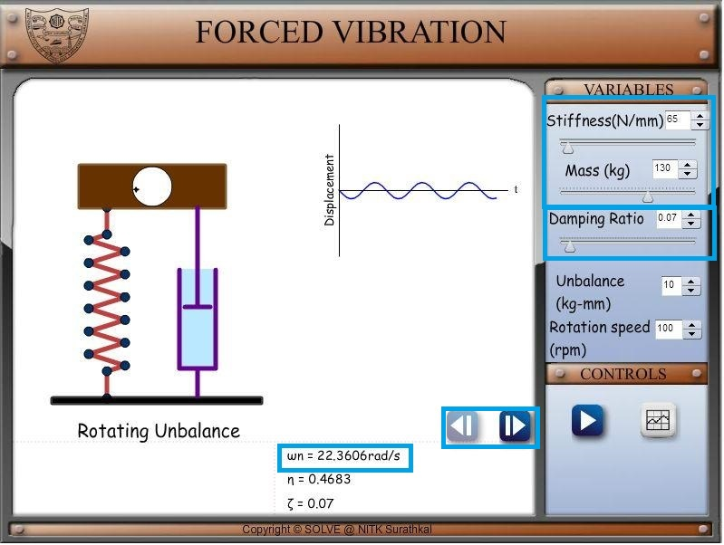
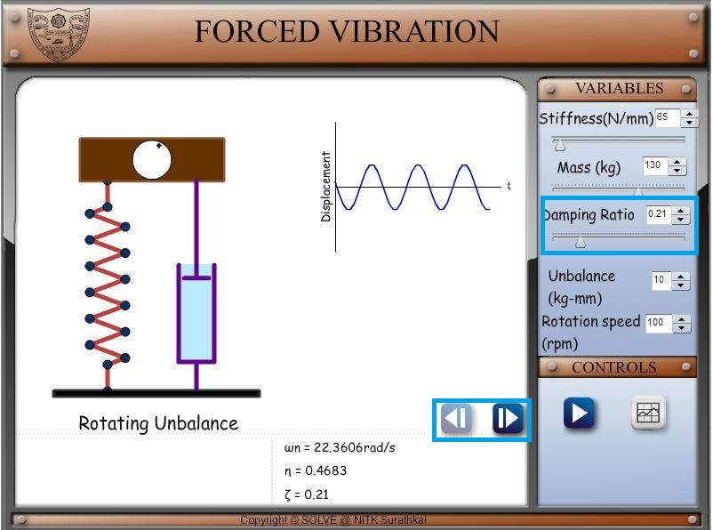
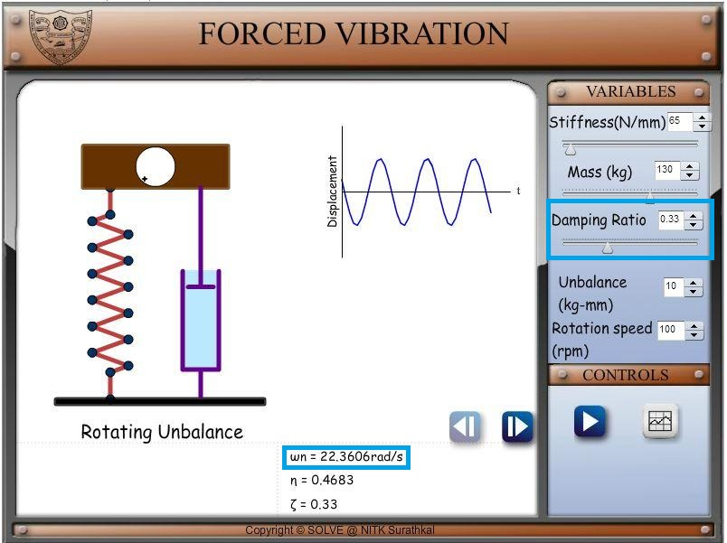
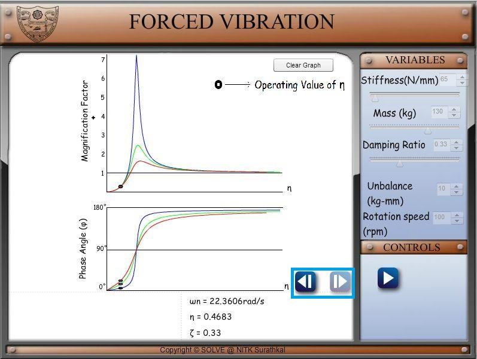

**AIM**:  
To observe the effect of damping in Forced Vibration of SDOF system using a Harmonic Force

**PROCEDURE**:

1. Set a value of Stiffness and Mass for the system. Set a small value of damping ratio (less than half of 0.707). Notice the natural frequency of the system shown below. Set a value of rotating speed in rpm which is not very close to natural frequency. You can also set a value for unbalance which is unbalance mass times eccentricity.  
   

2. Click on the right arrow to load the graph of magnification factor and phase angle versus frequency ratio.  
   

3. Click on the left arrow to come back to system display screen. Increase the value of damping and observe the change in Magnification factor as shown in below images.

  
  
  

